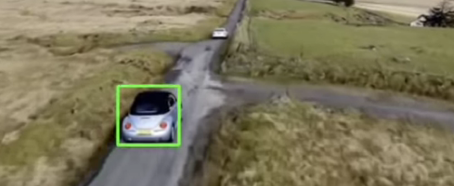

# Object Tracker using custom selection

The Object tracker is built using open-cv and different cv2 tracking libraries.

# YoloV3

You only look once (YOLO) is a state-of-the-art, real-time object detection system.
Built an Object detection/classification model using YoloV3.

